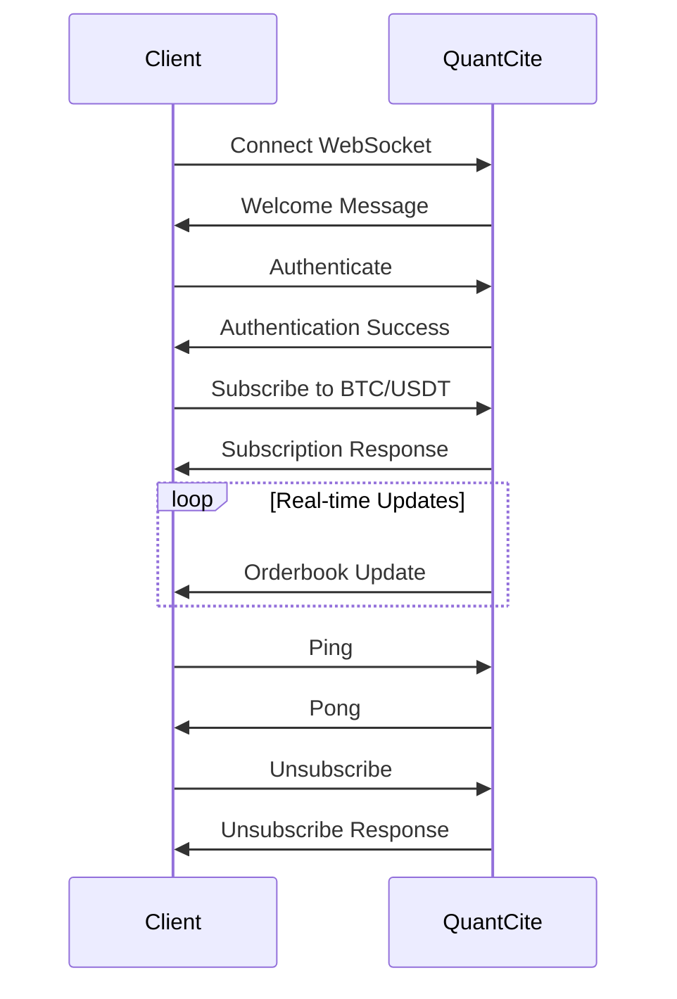

## Message Types Overview

The QuantCite WebSocket API uses JSON messages for all communication. Each message has a `type` field that identifies the message category.

## Authentication Messages

### Authenticate
Authenticate your WebSocket session.

**Request:**
```json
{
  "type": "authenticate",
  "api_key": "demo_key_123"
}
```

**Success Response:**
```json
{
  "type": "authentication_success",
  "user_id": "cb88461f-421a-4ac8-9722-afe248a40ae6",
  "tier": "premium",
  "message": "Authentication successful",
  "data_usage": {
    "used_gb": 12.5,
    "limit_gb": 50.0,
    "remaining_gb": 37.5
  }
}
```

**Error Response:**
```json
{
  "type": "authentication_error",
  "error": "invalid_api_key",
  "message": "The provided API key is invalid or expired"
}
```

## Subscription Messages

### Subscribe to Aggregated Orderbook
Subscribe to real-time orderbook updates.

**Request:**
```json
{
  "type": "subscribe_aggregated",
  "symbol": "BTC/USDT",
  "exchanges": ["binance", "okx", "bybit"]
}
```

**Response:**
```json
{
  "type": "aggregated_subscription_response",
  "symbol": "BTC/USDT",
  "exchanges": ["binance", "okx", "bybit"],
  "success": true,
  "subscription_id": "sub_123456"
}
```

### Unsubscribe from Symbol
Stop receiving updates for a trading pair.

**Request:**
```json
{
  "type": "unsubscribe_aggregated",
  "symbol": "BTC/USDT"
}
```

**Response:**
```json
{
  "type": "unsubscribe_response",
  "symbol": "BTC/USDT",
  "success": true,
  "message": "Successfully unsubscribed from BTC/USDT"
}
```

## Data Request Messages

### Get Supported Exchanges
Retrieve list of all supported exchanges.

**Request:**
```json
{
  "type": "get_exchanges"
}
```

**Response:**
```json
{
  "type": "exchanges_data",
  "data": {
    "supported_exchanges": ["binance", "okx", "bybit", "kucoin"],
    "active_exchanges": ["binance", "bybit", "kucoin"],
    "total_supported": 42,
    "total_active": 35,
    "exchange_status": {
      "binance": "active",
      "okx": "active",
      "kraken": "maintenance"
    }
  }
}
```

### Get Trading Pairs
Retrieve available trading pairs.

**Request (All Exchanges):**
```json
{
  "type": "get_pairs"
}
```

**Request (Specific Exchange):**
```json
{
  "type": "get_pairs",
  "exchange": "binance"
}
```

**Response:**
```json
{
  "type": "pairs_data",
  "data": {
    "exchanges": {
      "binance": ["BTC/USDT", "ETH/USDT", "BNB/USDT"],
      "bybit": ["BTC/USDT", "ETH/USDT", "SOL/USDT"]
    },
    "total_exchanges": 35,
    "total_pairs": 40747,
    "common_pairs": ["BTC/USDT", "ETH/USDT"]
  }
}
```

### Get Current Orderbook
Request current orderbook snapshot.

**Request:**
```json
{
  "type": "get_aggregated_orderbook",
  "symbol": "BTC/USDT"
}
```

**Response:**
```json
{
  "type": "aggregated_orderbook_data",
  "symbol": "BTC/USDT",
  "timestamp": "2025-08-19T19:45:13.392607",
  "data": {
    "bids": [...],
    "asks": [...],
    "market_stats": {
      "best_bid": 113393.9,
      "best_ask": 113400.0,
      "spread": 6.1
    }
  }
}
```

## Real-time Data Messages

### Orderbook Updates
Continuous orderbook updates for subscribed symbols.

```json
{
  "type": "aggregated_orderbook_update",
  "symbol": "BTC/USDT",
  "timestamp": "2025-08-19T19:45:13.392607",
  "update_number": 1,
  "subscription_id": "sub_123456",
  "data": {
    "bids": [
      {
        "price": 113393.9,
        "amount": 0.0001,
        "exchanges": ["bybit"],
        "exchange_count": 1,
        "value": 11.33939
      }
    ],
    "asks": [
      {
        "price": 113400.0,
        "amount": 0.0005,
        "exchanges": ["binance", "okx"],
        "exchange_count": 2,
        "value": 56.7
      }
    ],
    "market_stats": {
      "best_bid": 113393.9,
      "best_ask": 113400.0,
      "spread": 6.1,
      "spread_percent": 0.0054,
      "mid_price": 113396.95,
      "total_bid_volume": 0.0026,
      "total_ask_volume": 0.002,
      "participating_exchanges": 4
    }
  }
}
```

## System Messages

### Ping/Pong
Health check messages to maintain connection.

**Ping Request:**
```json
{
  "type": "ping"
}
```

**Pong Response:**
```json
{
  "type": "pong",
  "timestamp": "2025-08-19T20:45:13.392607",
  "server_time": "2025-08-19T20:45:13.392607",
  "latency_ms": 2.5
}
```

## Warning Messages

### Data Limit Warning
Notification when approaching or exceeding data limits.

```json
{
  "type": "data_limit_warning",
  "message": "Data streaming limit exceeded",
  "data_usage": {
    "used_gb": 52.3,
    "limit_gb": 50.0,
    "exceeded_by_gb": 2.3,
    "usage_percentage": 104.6
  },
  "action_required": "Contact support to increase your data limit"
}
```

### Rate Limit Warning
Notification when approaching rate limits.

```json
{
  "type": "rate_limit_warning",
  "message": "Approaching rate limit",
  "current_rate": 580,
  "limit": 600,
  "window": "per_minute",
  "reset_time": "2025-01-30T10:31:00Z"
}
```

## Error Messages

### Rate Limit Exceeded
```json
{
  "type": "error",
  "error": "rate_limit_exceeded",
  "message": "Rate limit exceeded. Please wait before sending more messages.",
  "retry_after": 60,
  "current_limit": 600,
  "window": "per_minute"
}
```

### Invalid Symbol
```json
{
  "type": "error",
  "error": "invalid_symbol",
  "message": "Symbol BTC/INVALID is not supported on any exchange",
  "symbol": "BTC/INVALID",
  "suggested_symbols": ["BTC/USDT", "BTC/USD", "BTC/EUR"]
}
```

### Exchange Not Available
```json
{
  "type": "error",
  "error": "exchange_unavailable",
  "message": "Exchange 'invalid_exchange' is not supported",
  "exchange": "invalid_exchange",
  "supported_exchanges": ["binance", "okx", "bybit", "kucoin"]
}
```

### Data Limit Exceeded
```json
{
  "type": "error",
  "error": "data_limit_exceeded",
  "message": "Monthly data limit of 50GB exceeded",
  "data_usage": {
    "used_gb": 51.2,
    "limit_gb": 50.0
  },
  "action_required": "Wait for monthly reset or contact support"
}
```

## Message Handling Best Practices

<CardGroup cols={2}>
  <Card title="Message Processing" icon="cpu">
    - Parse JSON messages safely
    - Handle unknown message types
    - Implement message queuing
    - Process updates asynchronously
  </Card>
  
  <Card title="Error Handling" icon="exclamation-triangle">
    - Implement retry logic
    - Handle network interruptions
    - Log error messages
    - Monitor connection health
  </Card>
</CardGroup>

## Message Flow Diagram



<Note>
  All timestamps in messages are in ISO 8601 format (UTC). Message sizes count toward your 50GB monthly data limit.
</Note>
